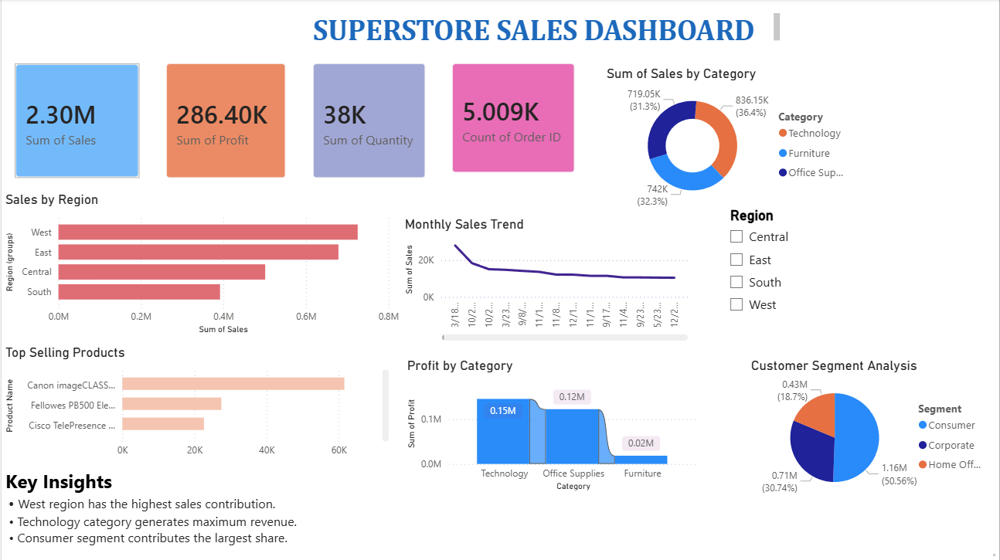

# 🛒 Superstore Sales Dashboard

An interactive sales analytics dashboard built using **Power BI**, **Python**, and **SQL** on the popular Superstore dataset.

---

## 📌 Project Overview

This project analyzes retail sales data to uncover insights around:
- Sales performance by region and category
- Profit trends over time
- Customer segmentation patterns

---

## 🛠️ Tools & Technologies

| Tool | Purpose |
|------|---------|
| Power BI | Dashboard & visualizations |
| Python (Pandas) | Data loading & preprocessing |
| SQL | Data querying |
| VS Code | Development environment |

---

## 📊 Dashboard Features

- KPI Cards (Total Sales, Profit, Orders)
- Bar Charts – Sales by Category & Sub-Category
- Line Charts – Monthly Profit Trends
- Donut & Pie Charts – Segment & Region breakdown
- Slicers – Filter by Region, Category, Date

---

## 📁 Folder Structure

    dashboard/   → Power BI file (.pbix)
    data/        → Raw dataset (CSV)
    images/      → Dashboard screenshots
    scripts/     → Python preprocessing scripts
    sql/         → SQL queries
    README.md

---

## 📸 Dashboard Preview

---

## 🚀 How to Run

1. Open the `.pbix` file in Power BI Desktop
2. Run `scripts/` Python files for data preprocessing
3. Connect to your local data source if needed
